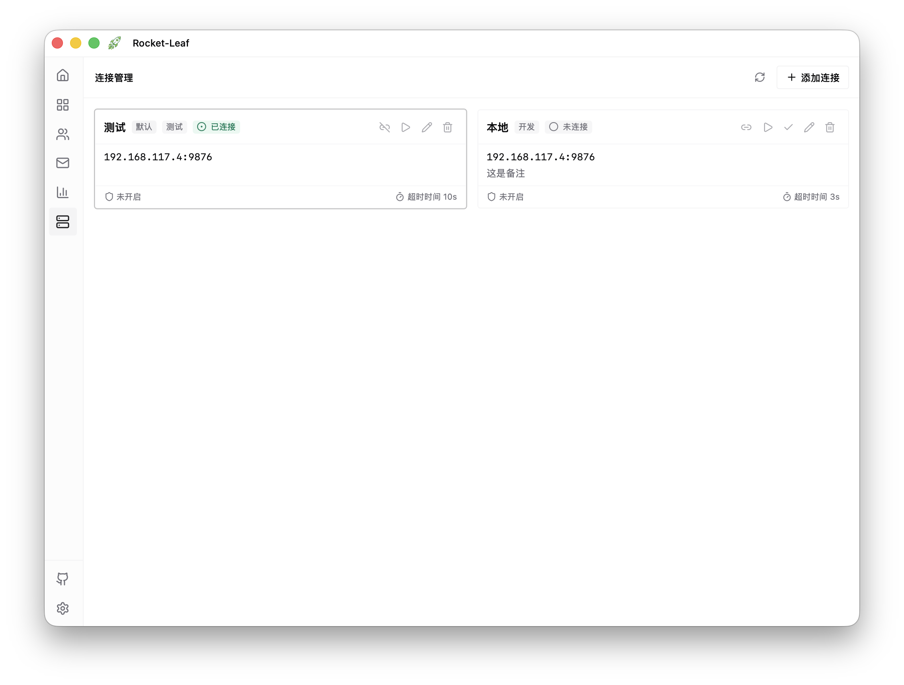
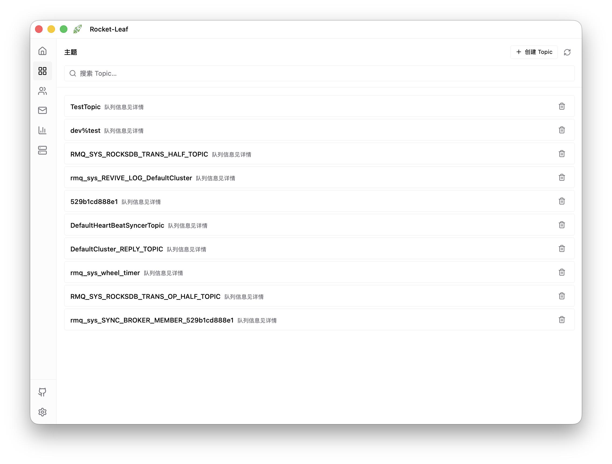
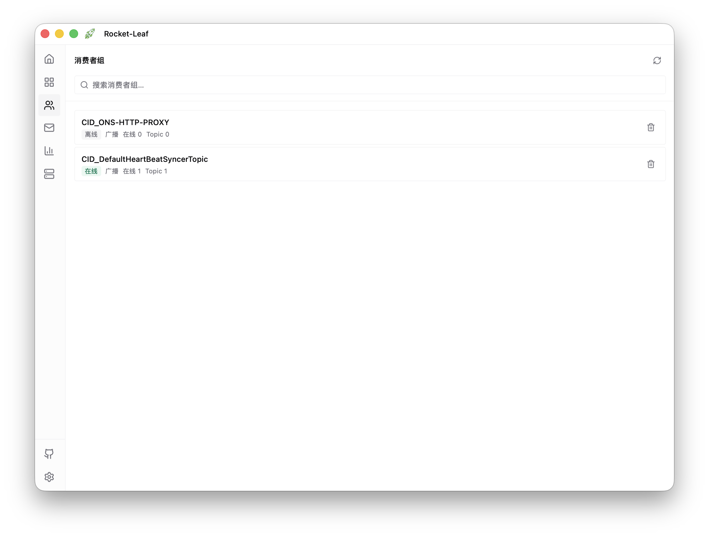
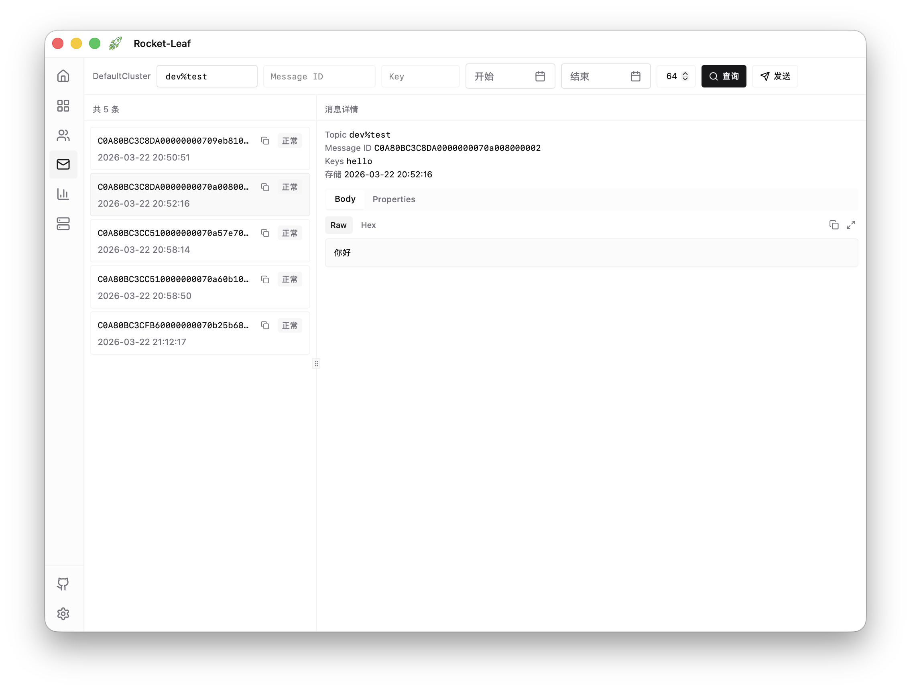
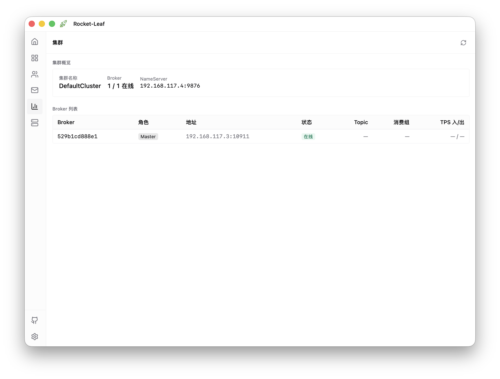
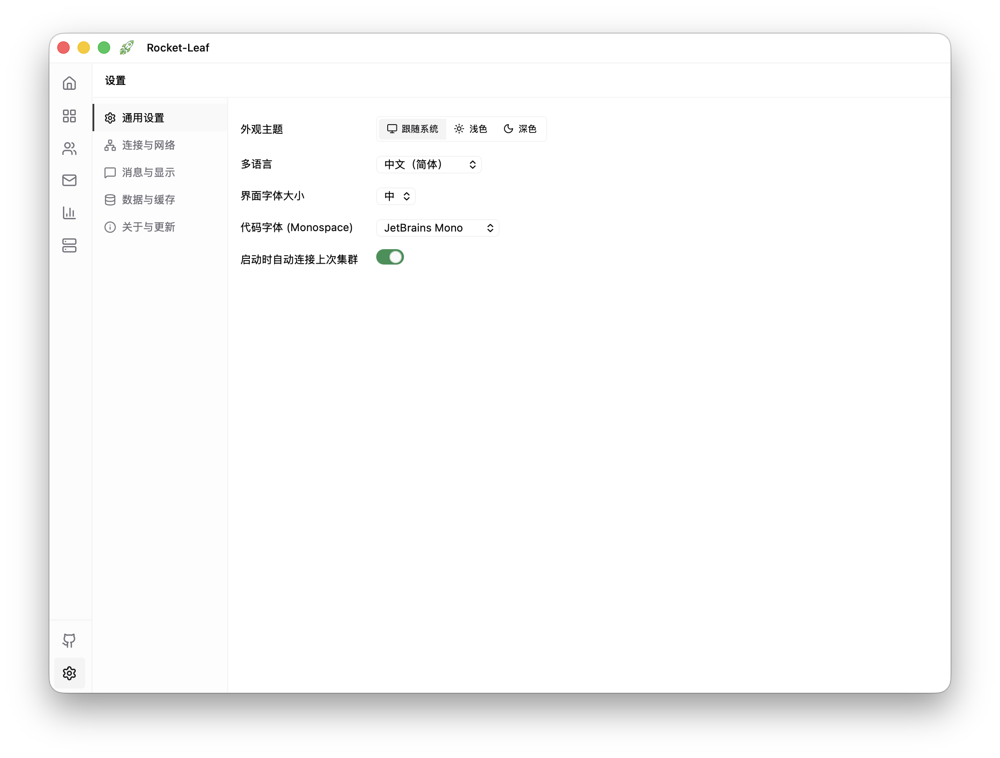

# Rocket-Leaf

  

  <strong>A lightweight, polished desktop client for RocketMQ</strong>

  Windows · macOS · Linux

  <a href="README.zh-CN.md">简体中文</a>

## What is Rocket-Leaf?

Rocket-Leaf is a **local desktop app** for connecting to and managing RocketMQ clusters. It helps you inspect topics, monitor consumers, query messages, and send test messages without deploying a web console or exposing management ports.

- **Ready to use**: download and launch directly
- **Cross-platform**: available on Windows, macOS, and Linux
- **Local-first data**: connection profiles stay on your machine and are easy to back up

## Features

| Capability | Description |
| ---------- | ----------- |
| **Connection Management** | Add multiple clusters, switch quickly, and persist profiles locally |
| **Topics** | Browse, search, inspect details, create, and delete topics |
| **Consumer Groups** | View groups, inspect offsets, reset progress, and review subscriptions |
| **Messages** | Query by Topic / Key / MessageId, inspect details, send test messages, and view traces |
| **Monitoring** | Check cluster health, producer and consumer TPS, and backlog status |

## Screenshots

| | |
|---|---|
|  |  |
| Connection Management | Topics |
|  |  |
| Consumer Groups | Message Query |
|  |  |
| Cluster Monitoring | Settings |

## Downloads

Download the package or executable for your platform from [Releases](https://github.com/codermast/rocket-leaf/releases).

### macOS

- **Intel Macs**: `rocket-leaf-macos-amd64.app.zip`
- **Apple Silicon Macs**: `rocket-leaf-macos-arm64.app.zip`
- **Not sure which one to choose**: `rocket-leaf-macos-universal.app.zip`

### Windows

- **x64**: installer and portable executable
- **ARM64**: installer and portable executable

### Linux

- **x64 / ARM64**: AppImage, `.deb`, `.rpm`, and `.pkg.tar.zst` when available

## Quick Start

1. Launch the app and click `Add Connection` on the home screen.
2. Enter your cluster details: NameServer address is required, and credentials are optional if your cluster uses authentication.
3. Save and connect. Once connected, you can use Topics, Consumer Groups, Message Query, and other tools from the sidebar.

Connection profiles are stored locally, so they will be available the next time you open the app.

Connection data locations

- **macOS**: `~/Library/Application Support/rocket-leaf/connections.json`
- **Linux**: `~/.config/rocket-leaf/connections.json`
- **Windows**: `%AppData%\rocket-leaf\connections.json`

## Roadmap and Development

- Product planning: [Roadmap](docs/ROADMAP.md)
- Contributing: issues and pull requests are welcome. See [Architecture](docs/ARCHITECTURE.md) for the current stack and project structure.

## License

[MIT](LICENSE) · Made with love by [CoderMast](https://github.com/codermast)
